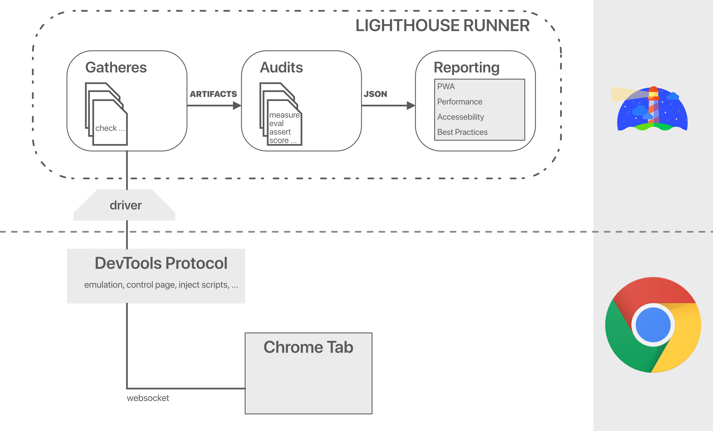

# A overview from the Lighthouse

---

## Its me

Lucas Recknagel


Exellio GmbH

Fullstack JavaScript Developer - Backend focused

Note:
My name is lucas ...

---

## Todays topics

* What is Lighthouse?
* How it works?
* Where I can use it and how?
* What comes next?

Note:
Today we talk over this 3 key points...

---

## What is Lighthouse?

- Version 1.0 introduced 2016 by @paul_irish
    - Only bundle a bunch of tests for PWA´s
    - Released as a Chrome-Addon
    - More a raising test idea

---

## What is Lighthouse?

- Version 2.0 released in 2017
    - [PWA-Checklist](https://developers.google.com/web/progressive-web-apps/checklist)
    - Web best practices
    - Performance metrics
    - Accessibility
    - SEO metrics
- Merged into Chrome DevTools 2017
- Available as nodejs module

Note:
current is 2.9 (Feb 2018)

PWA checklist, is my webpage app like?

Interesting part => nodejs module

Extensibility, bind to own test runners (travis ...), etc

(SEO Aug 2017 in Extention, Jan 2018 in Chrome DevTools)

---

## What is Lighthouse?


---

## What you also get

* manual check hints
* optimization suggestions
* some diagnostics (eg. critical request chains)

Note:
Manual hints: CrossBrowser caompatibale, each page has URL (deeplinks)

---

### Its a tool to:

* gain insight on the user experience
* help developers to deliver nice web apps

---

## Some words on progressive web metrics


Note:
Flow of a page load (from the users view)

Time To First Byte

First non blank paint

First contentful paint

First meaningful paint

Visually ready

Time To Interactive

---

## How it works



Note:
Stolen from the Google guys ...!

Connected via ChromeDevTools Protocol

powerful API, you can mainly control anything with that

Gatheres: inject js on page .. evaluate smth

---

## So many categories and audits ...


---

## Own Categories

- Write own, additional audits
- consisting of:
    - Gatherer
    - Audits
    - Config

---?code=src/js/performance-timing-gatherer.js&lang=js&title=Gatherer

@[1-3](Gatherer – Basic import with extended class.)
@[4-6](Gatherer – beforePass method.)
@[8-19](Gatherer – afterPass method.)
@[10](Gatherer – evaluateAsync call.)
@[1-21](Gatherer – whole Gatherer.)

Note:
afterPass => fire after page fully loaded

driver => connection between lighthouse and devtools protocol

evaluateAsync => run js in context of tab

---?code=src/js/performance-timing-audit.js&lang=js&title=Audit

@[1-3](Audit – Basic import with extended class.)
@[4-13](Audit – static meta override method.)
@[15-22](Audit – static audit method.)
@[16](Audit – Gatherer data extraction.)
@[1-25](Audit – whole Gatherer.)

Note:
static meta => overwrite audit meta to provide neccessary meta info

static audit => performs the audit computation

---?code=src/js/custom-config.js&lang=js&title=Config

@[1-2](Config – Default export and eslint like extention.)
@[3-6](Config – Passes load our gatherer the defaultPass.)
@[7](Config – Load our audit.)
@[8-14](Config – Create a new result category.)
@[12](Config – Weight for each audit.)
@[1-15](Config – Weight for each audit.)


Note:
Passes: number of time we reload the page

Passes: load our gatherer on the defaultPass section of lh

---

## So what we got now

```bash
lighthouse --config-path=./custom-config.js https://bestof.js.org/ --view
```


Note:
generate a html report file the dir of the config

---

### How do I use that in my tests?

---?code=src/lh_exec_runner/index.js&lang=js&title=Exec-Runner

@[1-3](Exec – Util and exec imports.)
@[7-8](Exec – Execute the lh command.)
@[10-11](Exec – Store result in json.)
@[1-18](Exec – Overall exec runner.)

Note:
how to move this into your test runner...

output to stdout exceed max stdout buffer size in most cases, write file

---?code=src/lh_programmatically/index.js&lang=js&title=Programmatically-Runner

@[1-3](PM-Runner - chromeLauncher, lh & log import)
@[5](PM-Runner - cfg to run only perf audits.)
@[7-9](PM-Runner - launch Chrome instance & set port.)
@[10-13](PM-Runner - execute lh on instance, kill it afterwards.)
@[10-13](PM-Runner - execute lh, kill Chrome and return results.)
@[16-18](PM-Runner - Run lh with only perf audits.)
@[20-24](PM-Runner - Run lh with all audits with flags.)
@[26-33](PM-Runner - Run lh with only perf audits with headless Chrome.)

Note:
Programmatically usage of chrome with lh

first: how to launch Chrome and obtain results

2nd: simple runPerfOnly

3nd: simple runFullWithLogs

2nd: simple runPerfOnlyHeadless

---

## Going a step further ...

---

## Chrome \-\-headless

* fully controllable Chrome instance
* most GUI actions are possible
* but: with code (eg. nodejs)
* [Chrome launcher](https://github.com/GoogleChrome/chrome-launcher)

Note:
but not really convenient ...

chrome launcher launches different version on diff platform
really nice to use in tests

---

## Puppeteer - bring all together


---

## Puppeteer

* like selenium, specific for Chrome
* has lastest Chromium version built in
* simplifies the usage of Chrome DevProtocol
* most Chrome functionality

Note:
Final 1.0 on 12th January
Coverage gathers information about parts of JavaScript and CSS that were used by the page.
https://github.com/GoogleChrome/puppeteer/blob/v1.0.0/docs/api.md#class-coverage

---

## Puppeteer, PhantomJS, Selenium, Nightmare

Note:
for chrossbrowser testing, several others

---

## Test it all

* Puppeteer only Chrome (Chromium)
* Alternatives:
    * [PhantomJS](https://github.com/ariya/phantomjs)
    * [Selenium](http://seleniumhq.github.io/selenium/docs/api/javascript/)
    * [Nightmare](https://github.com/segmentio/nightmare)
    * ...

Note:
Nightmare: Nightmare is a high-level browser automation library
CodeceptJS: testing framework for end-to-end

---

# The End
### Thanks for listening

---

## Useful stuff

```bash
yarn global add lighthouse
```

* [Lighthouse Overview](https://github.com/GoogleChrome/lighthouse)
* [CI integration](https://github.com/ebidel/lighthouse-ci)
* [DevTools-Protocol](https://chromedevtools.github.io/devtools-protocol/)
* [DevTools-Protocol](https://chromedevtools.github.io/devtools-protocol/)
* [Try Puppeteer](https://try-puppeteer.appspot.com/)

---

## Main Sources

* [The web](https://google.com)
* [Lighthouse Dev Page](https://developers.google.com/web/tools/lighthouse/)
* [Google Developer Days India](https://developers.google.com/events/gdd-india/)
* [Google Developer Updates](https://developers.google.com/web/updates/)

---