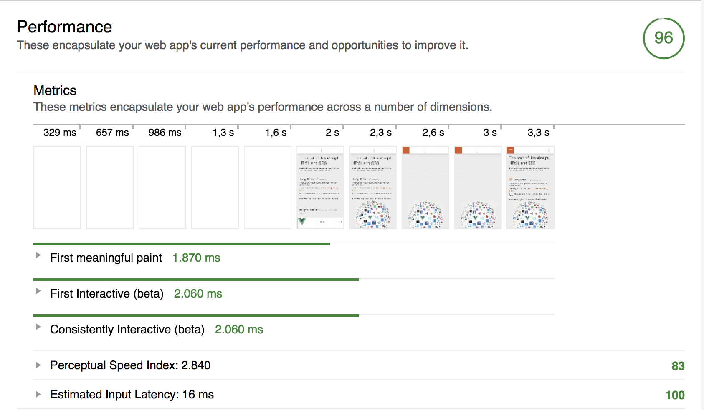

# A overview from the Lighthouse

---

## Its me

@fa[user-circle] Lucas Recknagel 
@fa[briefcase] Exellio GmbH

@fa[code] Fullstack JavaScript Developer - Backend focused

---

## Todays topic

* What is Lighthouse?
* How it works?
* Where I can use it and how?

Note:
Today we talk over this 3 key points..

---

## What is Lighthouse?

- Version 1.0 introduced 2016 by @paul_irish
    - Only bundle a bunch of tests for PWA´s
    - Released as a Chrome-Addon
    - More a raising test idea

---

## What is Lighthouse?

- Version 2.0 released in 2017
  - Check now:
      - [PWA-Checklist](https://developers.google.com/web/progressive-web-apps/checklist)
      - Web best practices
      - Performance metrics
      - Accessebility
      - SEO metrics (landed Aug 2017 in Extention)
- Merged into Chrome DevTools also in 2017
- Made available as nodejs module!

Note:
PWA checklist, is my webpage app like?
Interesting part => nodejs module
Extensibility, bind to own test runners (travis ...), etc

---

## What is Lighthouse?


---

### Its a tool to:

* gain insight on whats the user experience!
* help developers to deliver user friendlier web apps.

---

## Some words on progressive web metrics



Note:
Flow of a page load (from the users view)
Time To First Byte
First non blank paint
First contentful paint
First meaningful paint
Visually ready
Time To Interactive

---

## What you also got

* manual check hints
* optimization suggestions
* some diagnostics (eg. critical request chains)

---

## How it actually works


Note:
Stolen from the Google guys ...!
Connected via ChromeDevTools Protocol
powerful API, you can mainly control anything with that
Gatheres: inject js on page .. evaluate smth

---

## So many categories and audits ...


---

## Own Categories

- Write own, additional audits
- consisting of:
    - Gatherer
    - Audits
    - Config

---?code=src/js/performance-timing-gatherer.js&lang=js&title=Gatherer

@[1-3,20](Basic import with extended class.)
@[4-6](beforePass method.)
@[8-19](afterPass method.)
@[10](evaluateAsync call.)
@[1-21](whole Gatherer.)

Note:
afterPass => fire after page fully loaded
driver => connection between lighthouse and devtools protocol
evaluateAsync => run js in context of tab

---?code=src/js/performance-timing-audit.js&lang=js&title=Audit

@[1-3,23](Basic import with extended class.)
@[4-13](static meta override method.)
@[15-22](static audit method.)
@[16](Gatherer data extraction.)
@[1-25](whole Gatherer.)

Note:
static meta => overwrite audit meta to provide neccessary meta info
static audit => performs the audit computation

---?code=src/js/custom-config.js&lang=js&title=Config

@[1-2](Default export and eslint like extention.)
@[3-6](Passes load our gatherer the defaultPass.)
@[7](Load our audit.)
@[8-14](Create a new result category.)
@[12](Weight for each audit.)
@[1-15](Weight for each audit.)


Note:
Passes: number of time we reload the page
Passes: load our gatherer on the defaultPass section of lh

---

## So what we got now

```bash
lighthouse --config-path=./custom-config.js http://dresdenjs.io --view
```


Note:
generate a html report file the dir of the config

---?code=src/lh_exec_runner/index.js&lang=js&title=Exec-Runner

@[1-3](Util and exec imports.)
@[7-8](Execute the lh command.)
@[10-11](Store result in json.)
@[1-18](Overall exec runner.)

Note:
how to move this into your test runner...
output to stdout exceed max stdout buffer size in most cases, write file

---?code=src/lh_programmatically/index.js&lang=js&title=Programmatically-Runner

@[1-3](chromeLauncher, lh & log import)
@[5](cfg to run only perf audits.)
@[7-9](launch Chrome instance & set port.)
@[10-13](execute lh on instance, kill it afterwards.)
@[10-13](execute lh, kill Chrome and return results.)
@[16-18](Run lh with only perf audits.)
@[20-24](Run lh with all audits with flags.)
@[26-33](Run lh with only perf audits with headless Chrome.)

Note:
Programmatically usage of chrome with lh
first: how to launch Chrome and obtain results
2nd: simple runPerfOnly
3nd: simple runFullWithLogs
2nd: simple runPerfOnlyHeadless

---

## Chrome \-\-headless

* give you a full controllable Chrome instance
* you can do mostly everything like in the GUI
* but with code (eg. nodejs)
* [Chrome launcher](https://github.com/GoogleChrome/chrome-launcher)

Note:
chrome launcher launches different version on diff platform
really nice to use in tests

---

## Puppeteer


* nodejs module (lib) to work with headless Chrome
* has lastest Chromium version built in
* simplifies the usage of Chrome Dev Protocol (large API)

---

## Puppeteer

### Its like a "programmatic version of Selenium"

---

## Puppeteer

* create screenshots, pdfs
* emulate devices
* can run code in the webpage context
* intercept network request

---

# The End
### Thanks for listening

---

## Useful stuff

```bash
yarn global add lighthouse
```

* [Lighthouse Overview](https://github.com/GoogleChrome/lighthouse)
* [CI integration](https://github.com/ebidel/lighthouse-ci)
* [DevTools-Protocol](https://chromedevtools.github.io/devtools-protocol/)
* [DevTools-Protocol](https://chromedevtools.github.io/devtools-protocol/)
* [Try Puppeteer](https://try-puppeteer.appspot.com/)

---

## Main Sources

* [The web](https://google.com)
* [Lighthouse Dev Page](https://developers.google.com/web/tools/lighthouse/)
* [Google Developer Days India](https://developers.google.com/events/gdd-india/)

---